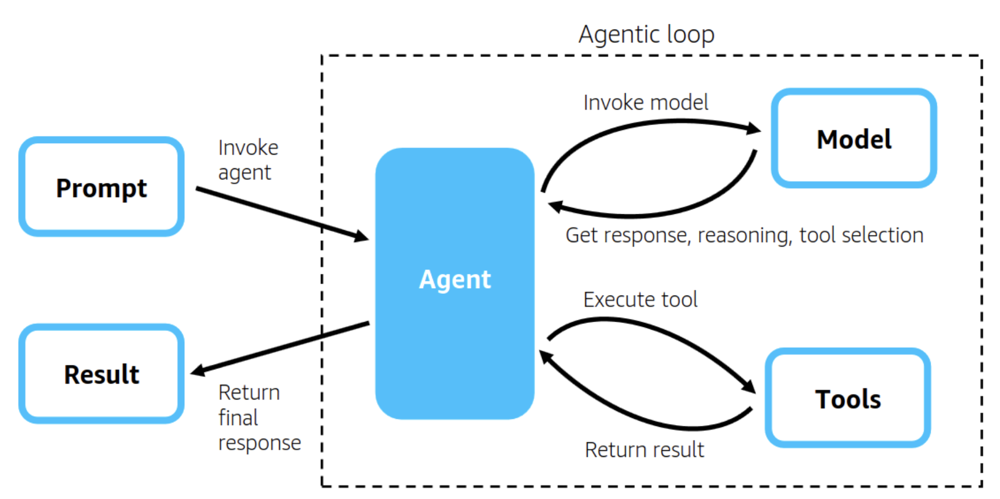

# Strands Agent



An AI agent development project leveraging Amazon Bedrock and the Strands Agents SDK.

## Project Overview

This project demonstrates how to build various AI agents using the Strands Agents SDK. You can create simple yet powerful agents centered around three core components: a model, tools, and a prompt.

## Key Features

### Included Utilities

- **advanced_rag_utils.py**: Advanced RAG (Retrieval-Augmented Generation) capabilities using AWS Bedrock
  - Knowledge Base retrieval and generation
  - Metadata filtering
  - Bedrock client configuration

- **llm_cost_utils.py**: LLM usage monitoring and cost calculation
  - Bedrock token count tracking
  - CloudWatch metrics integration
  - Cost analysis

### Use Cases

The Strands.ipynb notebook includes 10 practical use cases:

1. **Web Scraping**: Extract article titles and links from Hacker News
2. **Stock Price Analysis**: Moving averages, volatility, return rate analysis with visualizations
3. **Insurance Claims Inspection**: Weather data validation and DynamoDB storage
4. **Knowledge Base + Internet Search**: 10K document retrieval and news aggregation
5. **Custom Python Tools**: LLM usage calculator
6. **DataFrame Manipulation**: Data processing with pandas
7. **PySpark Data Processing**: Large-scale data transformation and storage
8. **Machine Learning Pipeline**: Customer churn prediction model
9. **Multi-Agent System**: Financial advisory agent orchestration
10. **MCP Integration**: AWS documentation querying and architecture diagram generation

## Installation

### Prerequisites

```bash
pip install strands-agents strands-agents-tools strands-agents-builder nest_asyncio uv
```

### Optional Libraries

```bash
# For financial analysis
pip install yfinance matplotlib

# For web scraping
pip install beautifulsoup4 pandas requests

# For machine learning
pip install scikit-learn joblib seaborn
```

## Usage

### Basic Agent Creation

```python
from strands import Agent

agent = Agent()
agent("Explain Amazon Bedrock Agents?")
```

### Agent with Tools

```python
from strands_tools import python_repl, file_write
from strands import Agent
import os

os.environ["BYPASS_TOOL_CONSENT"] = "true"

agent = Agent(tools=[python_repl, file_write])
response = agent("Scrape data from a web page and save it as CSV")
```

### Defining Custom Tools

```python
from strands import tool, Agent

@tool
def my_custom_tool(query: str) -> str:
    """Custom tool description"""
    # Tool logic
    return result

agent = Agent(tools=[my_custom_tool])
```

## Configuration

Create a `variables.json` file in the project root to configure AWS settings:

```json
{
  "kbSemanticChunk": "your-knowledge-base-id",
  "region": "us-west-2",
  "account_number": "your-aws-account-number"
}
```

## Supported Models

- Amazon Bedrock models (Nova, Claude, Titan, etc.)
- Anthropic Claude model family
- Ollama (for local development)
- Other providers via LiteLLM

## File Structure

```
.
├── Strands.ipynb                      # Main demo notebook
├── research_agent_kb_internet.ipynb   # Research agent example
├── advanced_rag_utils.py              # RAG utility functions
├── llm_cost_utils.py                  # Cost calculation tools
├── kb_id.txt                          # Knowledge Base ID
├── strands.png                        # Project image
├── README.md                          # This file (English)
└── README-kr.md                       # Korean version
```

## Key Highlights

- **Model-Driven Approach**: Easy integration with various LLM models
- **Rich Tool Ecosystem**: 20+ pre-built tools and MCP server support
- **Simple API**: Build powerful agents with just a few lines of code
- **Scalable**: From local development to production deployment
- **AWS Integration**: Native integration with Bedrock, DynamoDB, CloudWatch, and more

## Resources

- [Strands Agents Official Documentation](https://docs.strands.ai)
- [Amazon Bedrock Documentation](https://docs.aws.amazon.com/bedrock/)
- [Strands Agents Announcement Blog](https://aws.amazon.com/blogs/)
- [Advanced RAG using Bedrock and SageMaker - AWS Samples](https://github.com/aws-samples/sample-advanced-rag-using-bedrock-and-sagemaker/tree/main)

## License

Please contact the project owner for licensing information.

## Contributing

Issues and pull requests are welcome!
